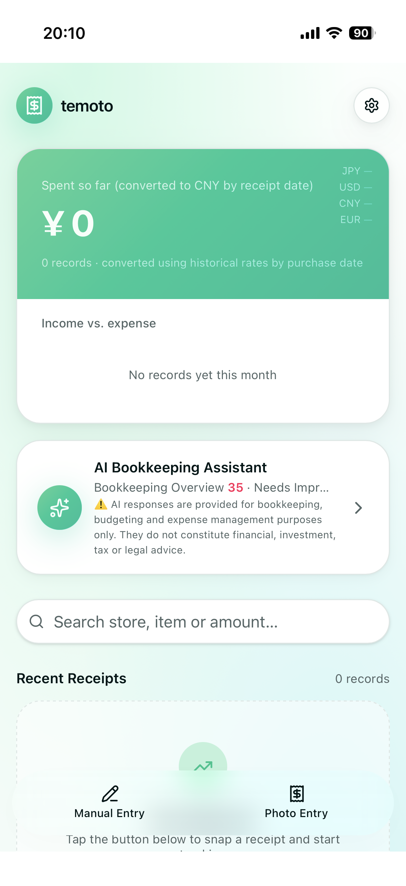
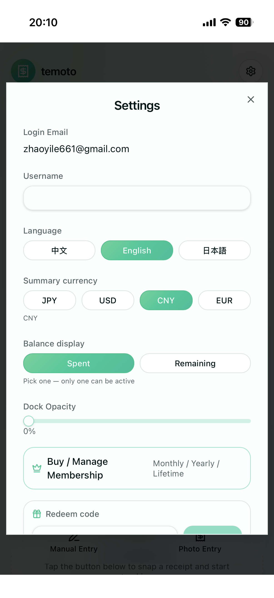
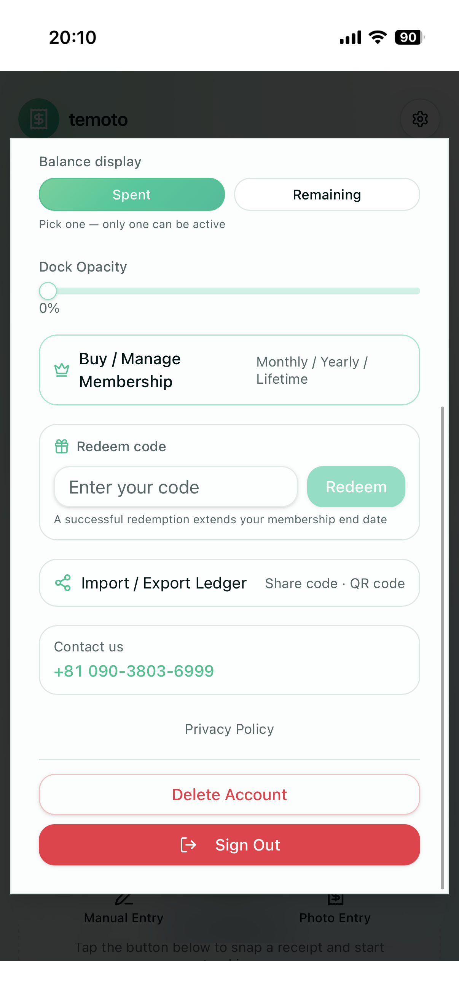
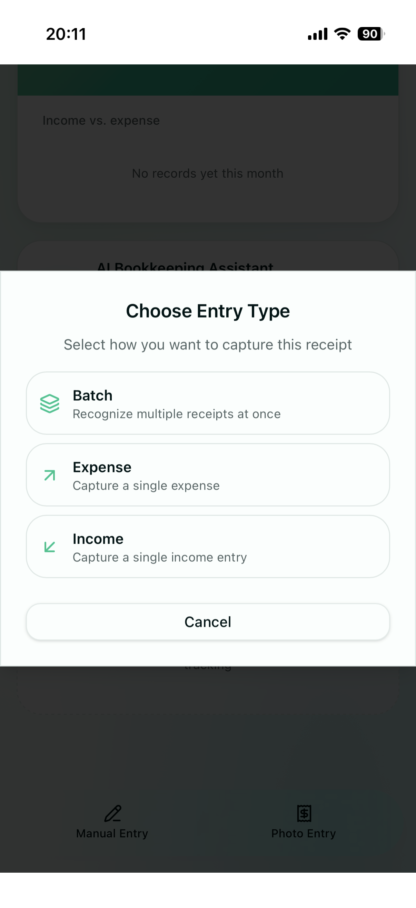
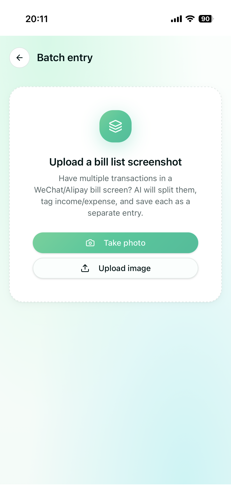
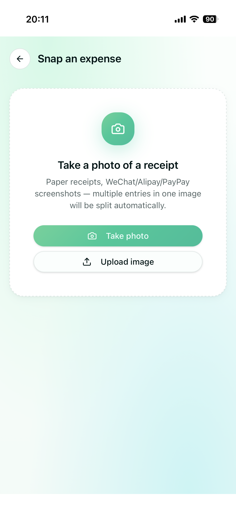
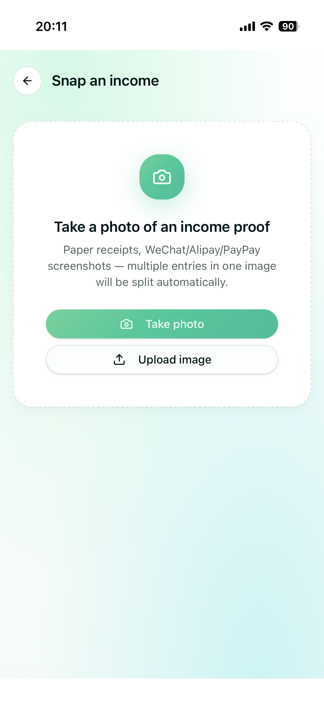
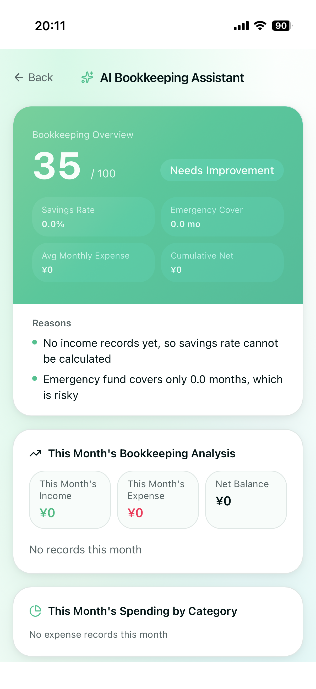
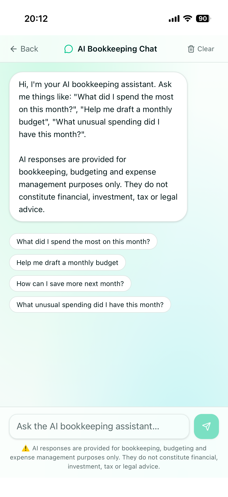

# AI Ledger (temoto)

An AI-powered bookkeeping application that helps users record expenses using OCR and AI.

## Features

- 📷 AI Receipt OCR
- 🤖 AI Bookkeeping Assistant
- 🌍 Multi-language Support (Chinese / English / Japanese)
- 📊 Monthly Expense Statistics
- ☁️ Cloud Sync
- 💳 Paddle Subscription

## Tech Stack

- Lovable
- React
- Supabase
- Paddle
- OpenAI

## Current Status

🚧 Currently under development.

## Roadmap

- Improve OCR speed
- Improve OCR accuracy
- iOS App
- Android App
- PDF Export
- Family Account
- Shared Ledger

## License
---

## 📱 App Screenshots

  
  

  
  

  
  

  
  

  

Copyright © 2026 AI Ledger
